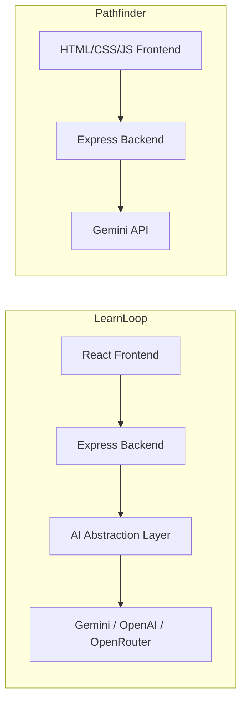
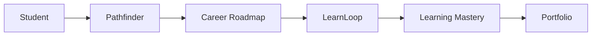

# 🎓 **PathwayAI**

**An AI-powered personalised learning and career intelligence platform built for a hackathon.**


---

## 📑 Table of Contents

- [Project Overview](#-project-overview)
- [Repository Structure](#-repository-structure)
- [Features](#-features)
  - [LearnLoop](#learnloop)
  - [Pathfinder](#pathfinder)
- [Tech Stack](#-tech-stack)
- [Prerequisites](#-prerequisites)
- [Installation](#-installation)
- [Setup Instructions](#-setup-instructions)
- [Running the Applications](#-running-the-applications)
- [Environment Variables](#-environment-variables)
- [Demo Workflow](#-demo-workflow)
- [Screenshots](#-screenshots)
- [AI Architecture](#-ai-architecture)
- [Project Architecture](#-project-architecture)
- [Security Notes](#-security-notes)
- [Current MVP Limitations](#-current-mvp-limitations)
- [Future Improvements](#-future-improvements)
- [Team](#-team)
- [License](#-license)

---

## 🚀 Project Overview

**PathwayAI** combines two applications — **Pathfinder** and **LearnLoop** — into a single, integrated AI-powered platform for personalised learning and career growth.

- **Pathfinder** helps students discover suitable careers, identify skill gaps, and generate personalised career roadmaps.
- **LearnLoop** helps students master learning material using AI-generated learning paths and the **Feynman Technique**.

Together, these applications guide a student on an end-to-end journey: from **career planning and skill-gap discovery** in Pathfinder, to **demonstrated learning mastery** in LearnLoop — turning a roadmap into real, verified knowledge.

---

## 📂 Repository Structure

```
PathwayAI/
├── LearnLoop/      # AI-powered personalised learning platform
└── Pathfinder/     # AI-powered career intelligence platform
```

Each application is an **independent Node.js project** with its own dependencies, configuration, and start-up process. They are designed to run side by side and share the same student journey.

---

## ✨ Features

### LearnLoop

- 📄 PDF Upload
- 🧠 AI Topic Extraction
- 🛤️ Personalised Learning Path
- 📅 Study Planner
- ⏱️ Pomodoro Timer
- 🗣️ Feynman Technique Evaluation
- 🔁 Adaptive Revision Scheduling
- 📊 Progress Dashboard
- 🎮 Demo Mode
- ⚙️ AI Provider Configuration

### Pathfinder

- 🤖 AI Career Analysis
- 🎯 Career Matching
- 📉 Skill Gap Analysis
- 🗺️ Personalised Career Roadmap
- 🛠️ Project Recommendations
- ✅ Daily Missions
- 💼 Portfolio Tracking
- 🔍 Opportunity Recommendations

---

## 🧰 Tech Stack

| Application | Technologies |
|---|---|
| **LearnLoop** | React, TypeScript, Vite, Tailwind CSS, Express, Node.js, PDF parsing, OpenAI-compatible AI abstraction, Gemini/OpenAI/OpenRouter compatible |
| **Pathfinder** | HTML, CSS, JavaScript, Node.js, Express, Google Gemini API, Local storage |

---

## ✅ Prerequisites

- **Node.js 20+**
- **npm**
- An **AI API key** (Gemini / OpenAI / OpenRouter) if using live AI features

---

## 📥 Installation

```bash
git clone <repository-url>
cd PathwayAI
```

---

## 🔧 Setup Instructions

Both applications need their dependencies installed **separately**.

### LearnLoop

```bash
cd LearnLoop
npm install
```

### Pathfinder

```bash
cd ../Pathfinder
npm install
```

---

## ▶️ Running the Applications

### Start LearnLoop

```bash
cd LearnLoop
npm run dev
```

LearnLoop runs using the **Vite development server**.

### Start Pathfinder

Open another terminal:

```bash
cd Pathfinder
npm start
```

Pathfinder runs its **Express server** separately.

> ⚠️ **Note:** Both applications should be running **simultaneously** during the hackathon demo.

---

## 🔐 Environment Variables

### LearnLoop `.env.example`

```env
PORT=3001
AI_PROVIDER=openai
AI_MODEL=gpt-5-mini
AI_API_KEY=your_api_key_here
AI_BASE_URL=
```

| Variable | Description |
|---|---|
| `PORT` | Port on which the LearnLoop server runs |
| `AI_PROVIDER` | The AI provider to use (e.g. `openai`, `gemini`, `openrouter`) |
| `AI_MODEL` | The specific model name to call |
| `AI_API_KEY` | API key for the selected AI provider |
| `AI_BASE_URL` | Optional custom base URL for OpenAI-compatible endpoints |

### Pathfinder `.env.example`

```env
GEMINI_API_KEY=your_gemini_api_key_here
PORT=5000
```

The Gemini API key is used **only by the backend** and is never exposed to the client.

---

## 🧭 Demo Workflow

### Pathfinder

1. Enter skills and interests.
2. AI analyses profile.
3. Career matches generated.
4. Skill gap report displayed.
5. Personal roadmap created.
6. Projects and missions suggested.

### LearnLoop

1. Upload PDF or use Demo Mode.
2. AI analyses document.
3. Learning path generated.
4. Study topic.
5. Complete Feynman Check.
6. Receive AI feedback.
7. Master topic.
8. Revision scheduled.

---

## 🖼️ Screenshots

| LearnLoop | Pathfinder |
|---|---|
|  |  |
|  |  |
|  |  |
|  | |
|  | |

---

## 🧠 AI Architecture

### LearnLoop

- Uses an **OpenAI-compatible AI abstraction layer**.
- Supports **Gemini, OpenAI, OpenRouter**, and custom endpoints.
- Keeps **API keys server-side**.
- Uses **structured JSON prompts** for consistent, parseable AI output.

### Pathfinder

- Uses the **Gemini API** for career analysis.
- Converts free-form student profiles into **structured career intelligence**.



---

## 🏗️ Project Architecture



---

## 🔒 Security Notes

- API keys are stored in `.env` files.
- `.env` should **never** be committed to version control.
- Uploaded PDFs are **validated** before processing.
- AI requests happen **server-side** to keep credentials safe.

---

## ⚠️ Current MVP Limitations

- Pathfinder recommendations are **AI-generated heuristics**, not guaranteed outcomes.
- LearnLoop primarily analyses **text-based PDFs**.
- **No authentication** is currently implemented.
- **Local persistence only** — no cloud database.
- Opportunity recommendations are **categories**, not live job listings.

---

## 🔮 Future Improvements

- 📄 Resume analysis
- 🐙 GitHub integration
- 💼 Internship APIs
- 🔎 OCR for scanned PDFs
- 📚 Multi-document learning
- ☁️ Cloud accounts
- 🔁 Adaptive spaced repetition improvements

---

## 👥 Team

Built during the Odessa Hackathon by **Team Odessa**.

- [Abraham B Mathew](https://github.com/abrahammathewmalayidan)
- [Gopathi Krishna U Nair](https://github.com/G4TON)
- [Vishnu Chandrabose](https://github.com/RandomDude325)

---

## 📄 License

This project is licensed under the **MIT License**.
